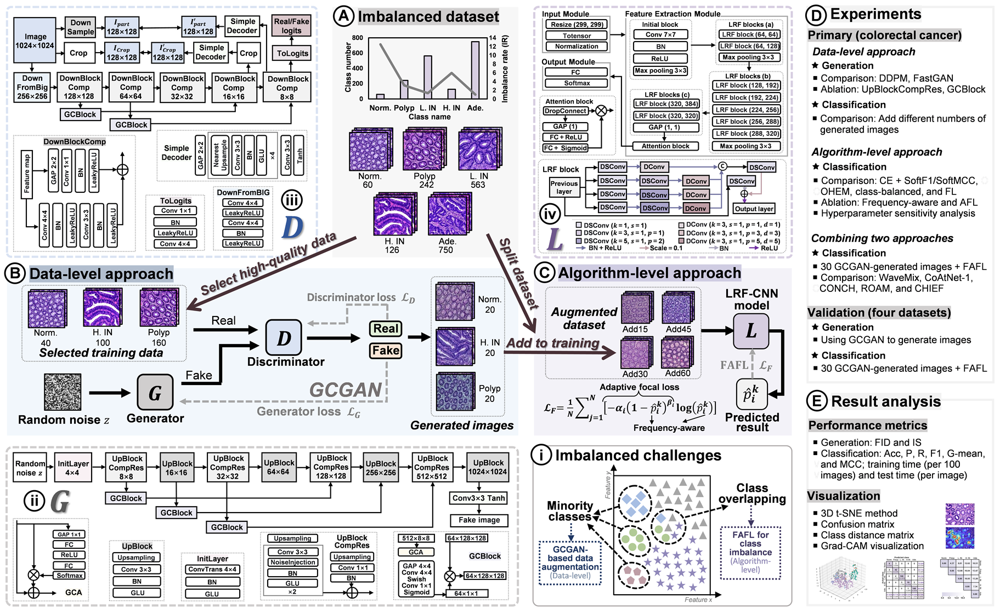

# MCIHIC: Mitigating Class Imbalance in Histopathological Image Classification for Colorectal Cancer Using Data-level and Algorithm-level Approaches

**Status:** Under Review


## Authors

Lingling Yuan, Yang Chen, Md Rahaman, Hongzan Sun, Xiaoyan Li, Haoyuan Chen, Yutong Gu, Mengqing Su, Marcin Grzegorzek, Chen Li


## Abstract

Histopathological image classification is crucial for colorectal cancer (CRC) diagnosis but suffers from severe class imbalance, leading to biased predictions and degraded performance. To mitigate this problem, we propose a novel framework that integrates data-level and algorithm-level approaches. Specifically:  
1. **Data-level approach:** A global context generative adversarial network (GCGAN) is employed for data augmentation, generating realistic images to enhance dataset diversity.  
2. **Algorithm-level approach:** A frequency-aware adaptive focal loss (FAFL) incorporates frequency-aware offset and adaptive modulation to improve the classification of overlapping classes.  
3. **Classification model:** A lightweight receptive field-based CNN (LRF-CNN) is optimized to improve classification performance.

Extensive experiments on CRC datasets demonstrate that the proposed framework outperforms five state-of-the-art (SOTA) models in multiple evaluation metrics. Additional validation on multiple histopathological datasets confirms the generalizability and effectiveness of the proposed approaches.


  



## Environment Setup

### Classification Task Environment

## Environment Setup

This project is developed with **Python 3.8.18** and **PyTorch 1.13.1+cu117**. Follow the steps below to create a new conda environment named **MCIHIC** and install the necessary dependencies:

```bash
conda create --name MCIHIC python=3.8.18 -y
conda activate MCIHIC
pip install torch==1.13.1+cu117 torchvision==0.14.1+cu117 --extra-index-url https://download.pytorch.org/whl/cu117
pip install -r requirements.txt
 ``` 


### Generation Task Environment

For the generation task, please refer to the [FastGAN-pytorch repository](https://github.com/odegeasslbc/FastGAN-pytorch) for environmental details and dependency information.


## Dataset and Pre-trained Weights

The dataset partitioning strategy and pre-trained weights used in our experiments can be obtained upon request. For more details regarding the dataset splits and accessing the pre-trained models, please contact the first author:

**Email:** [yuanlingling0314@163.com](mailto:yuanlingling0314@163.com)


